# VSCode4Teaching

VSCode4Teaching is a [Visual Studio Code](https://code.visualstudio.com) extension that brings the programming exercises of a course directly to the student’s editor, so that the teacher of that course can check the progress of the students and help them. It was created and expanded by Iván Chicano Capelo (whose blog can be read clicking [here](https://medium.com/@ivchicano)) and Álvaro Justo Rivas Alcobendas. Currently, this project is being developed by Diego Guerrero Carrasco. All the information about the progress of this stage of the project can be read in [this blog](https://medium.com/@diego-guerrero).

## Table of contents
- [User guide](#user-guide)
  - [Introduction](#introduction)
  - [Download and installation](#download-and-installation)
  - [Typical use cases](#typical-use-cases)
- [Developer guide](#developer-guide)
  - [License](#license)
  - [Architecture](#architecture)
  - [How to quickly start up a server](#how-to-quickly-start-up-a-server)

## User guide

**Sections**
- [Introduction](#introduction)
- [Download and installation](#download-and-installation)
- [Typical use cases](#typical-use-cases)

### Introduction
VSCode4Teaching users can be either teachers or students.

- **Teachers** can create, modify and delete courses on the platform, and each course can contain several exercises. In this way, teachers can add exercises (one at a time or in bulk) based on pre-existing code templates, proposing to students to work on these templates to fulfill the exercises.
  - Teachers can either manually enroll students in their courses using the buttons provided in each course or generate a sharing link to send to their students, who will open it in a browser where they will see a help screen explaining how to enroll in the course.
  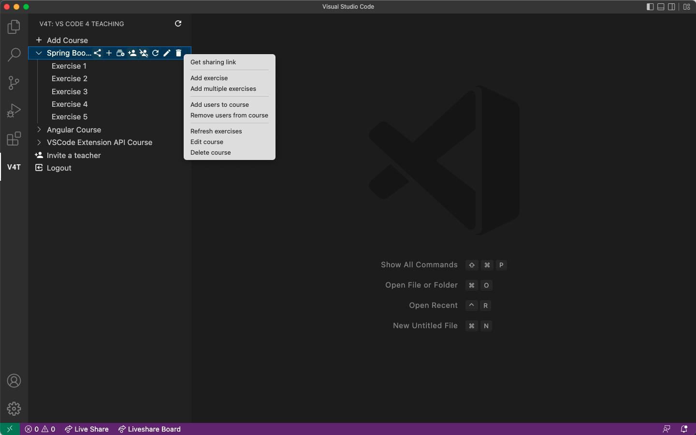
  - Teachers can display a dashboard, which is a screen that allows them to view the progress of students in completing the exercises in real time. They can see which students are working yet or have already completed the exercises, how long ago the last update of an exercise took place, which files have been created, modified or deleted in each of the students' proposals and, in addition, graphically view the differences between the students' files and the template originally uploaded by the teacher.
  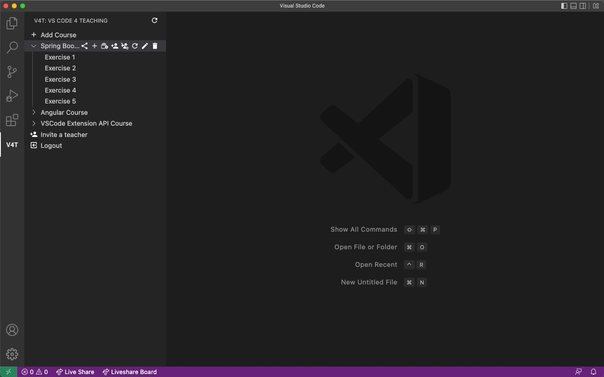
  - Teachers can visualize in their file system the students' exercises saved in an anonymized way, which will be synchronized in real time as they are completed by the students. To find out which directory corresponds to which student, the teacher will have to use the dashboard.
- **Students**, on the other hand, can join courses and complete the exercises proposed by their teachers.
  - To join courses, students must wait for a teacher to register them manually or they can receive an invitation link from the teacher. When opening the link in a web browser, students can view a help page that explains textually and graphically how to register for courses and how to use the extension in detail.
  
  - When students start a new exercise, the template proposed by the teacher is downloaded to their local file system to be filled in.
  - Once an exercise has been completed, students have a button to indicate to the teacher that the exercise has been completed and, from that moment on, it will not be possible to edit the proposed submission.
  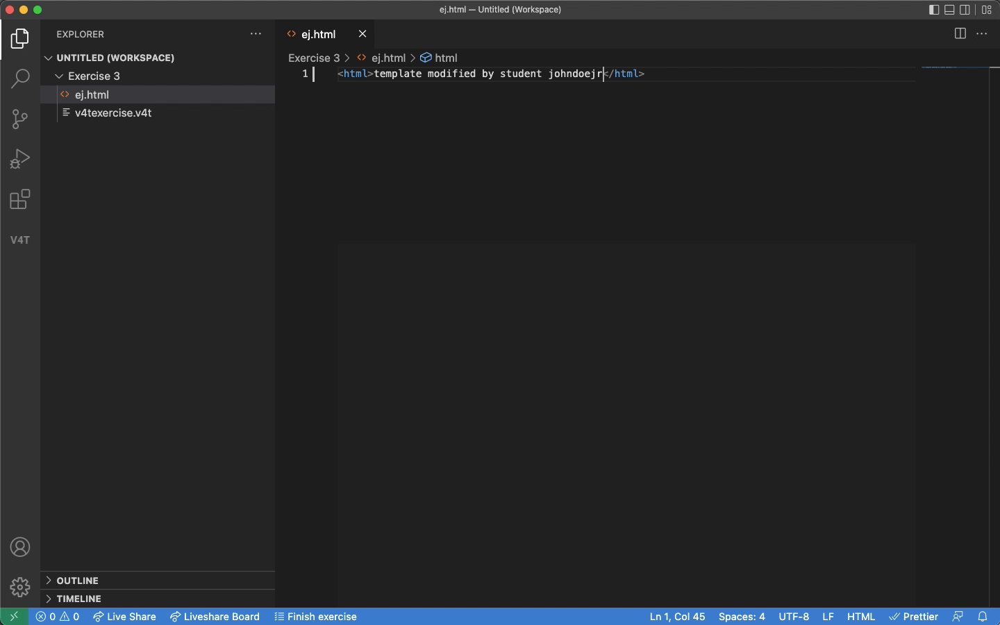

### Download and installation
To start using VSCode4Teaching as a user in your local Visual Studio Code installation, you need to:
- Access the Visual Studio Code *Marketplace* by clicking on the corresponding icon in the sidebar.
- Search for the extension using the top bar ("VSCode4Teaching").
- Install the latest available version and all required dependencies (like, for example, the *LiveShare* extension). A prompt will be displayed when installing in the IDE so as to install the associated dependencies.
  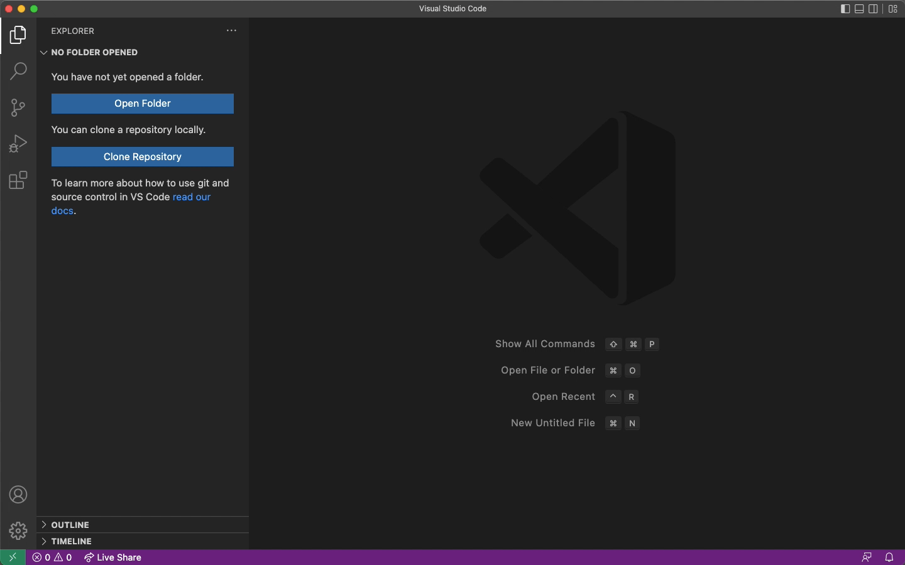
- When the extension is installed, it could be necessary to change its own settings to modify the local directory used or the URL of the server. These preferences can be set in the IDE preferences within the extension's specific section.
  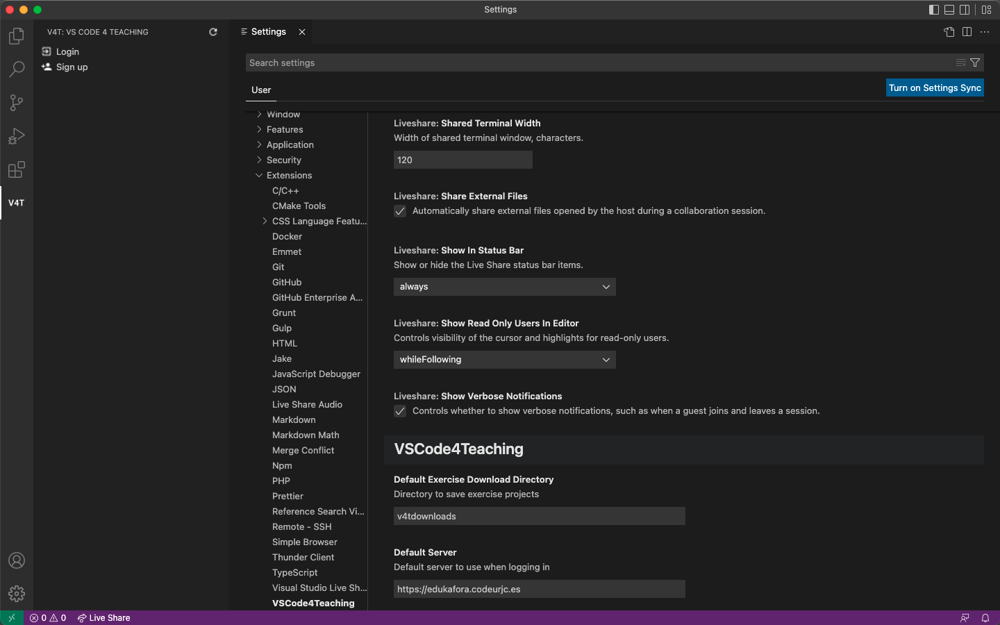

### Typical use cases
Some of the main use cases of user-system and user-to-user interaction in VSCode4Teaching are introduced below in textual and graphical sequence format.

Note: it is possible to enlarge the inserted images and GIFs by clicking on them.

#### Teacher invitation and registration
For this case two users are assumed: Teacher 1 (previously registered teacher) and Teacher 2 (new teacher), so that Teacher 1 invites Teacher 2 to register as a new teacher on the platform.

| Teacher 1 | Teacher 2 |
| :-------: | :-------: |
| **1**. The user logs in. 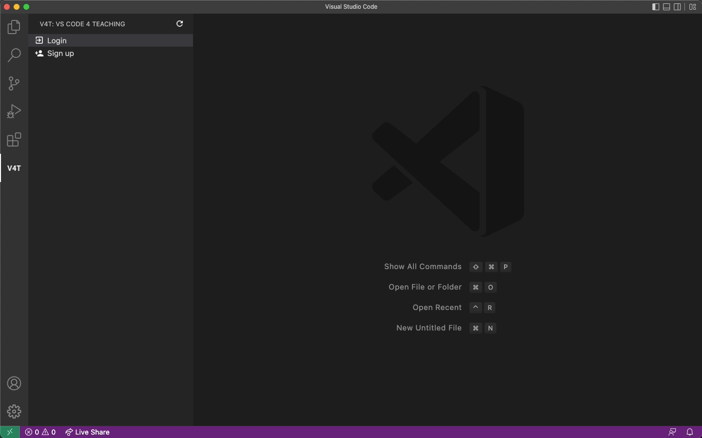 | |
| **2**. The user fills in the invitation for the new teacher using the button and the form provided for this purpose. You must enter: name and surname, e-mail and user name of the new teacher. | |
| **3**. An invitation link is generated. It has to be sent to the new teacher. 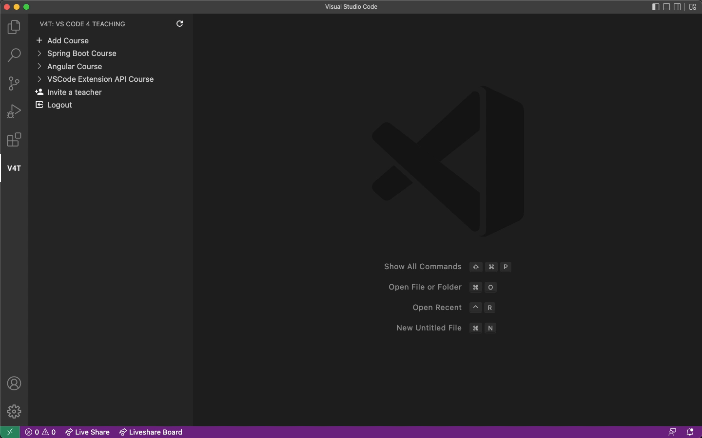 | |
| | **4**. The new teacher will open the link received in a browser to complete the registration process. To do so, they enter their user name (for identity verification) and choose their new password. 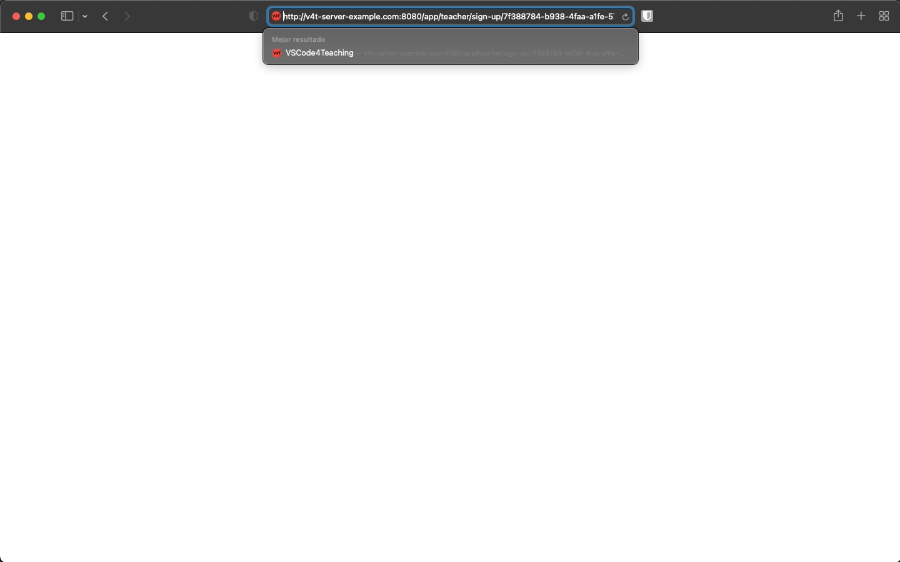 |
| | **5**. Done! The new teacher can now log in to VSCode4Teaching successfully. 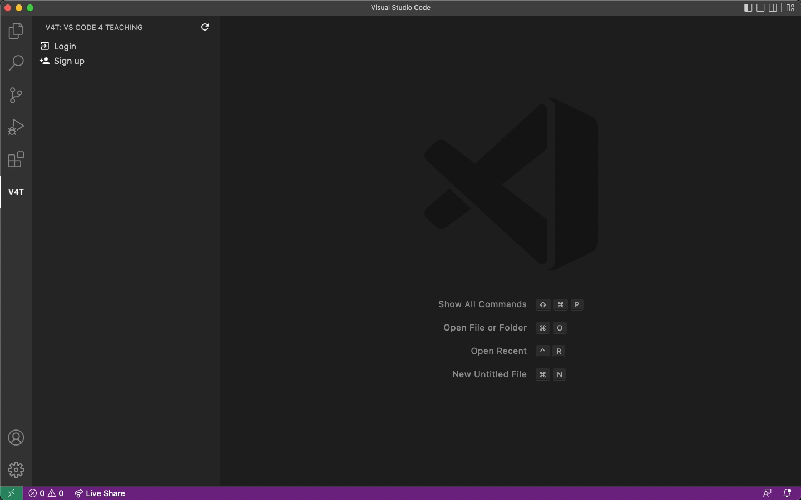 |

#### Course creation and student participation
In this case, a teacher logs in, creates a subject, adds exercises and invites students who, once enrolled, proceed to fill in the exercises and send them to the teacher.

| Teacher | Student |
| :-----: | :-----: |
| **1**. The user logs in.  | |
| **2**. The user creates a new course. 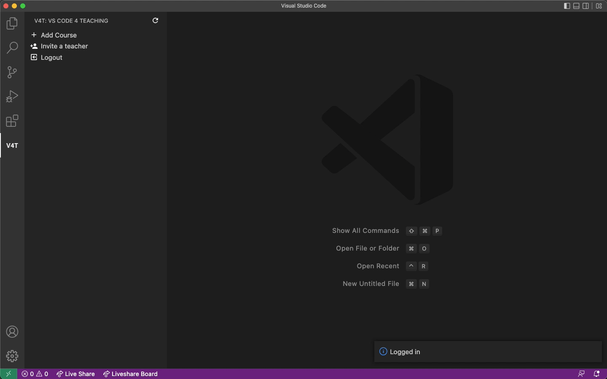 | |
| **3**. The user adds some new exercises in bulk. 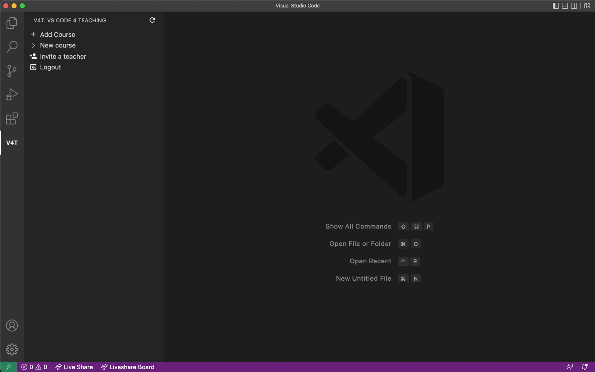 | |
| **4**. The user generates the course invitation link and sends it to one (or more) students. 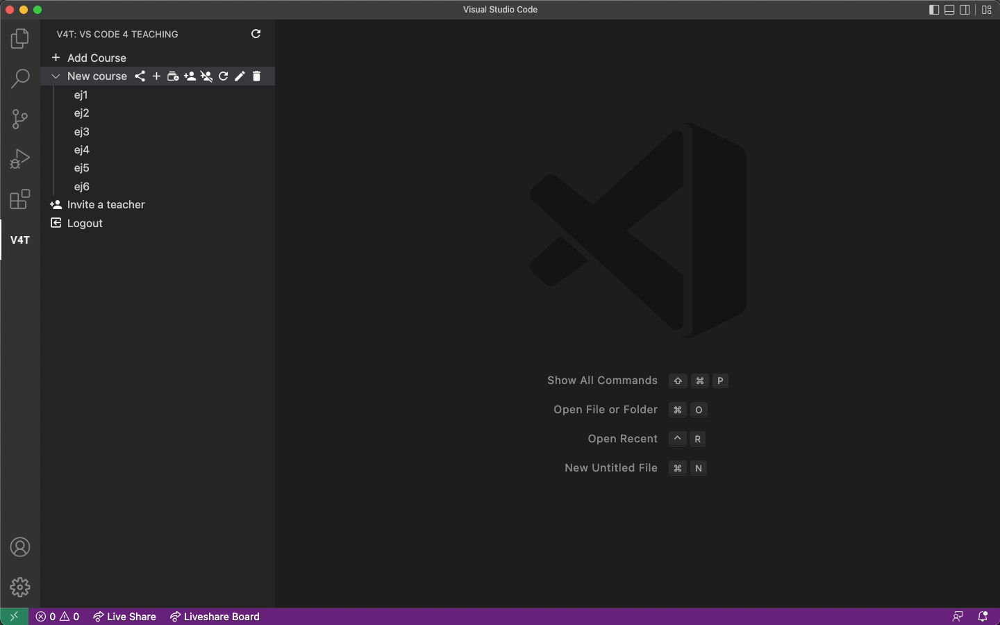 | |
| | **5**. The student accesses the link in a web browser, where they can view a help page and copy a specific code to join the course.  |
| | **6**. The student uses the code copied in the extension to join the course shared by their teacher. 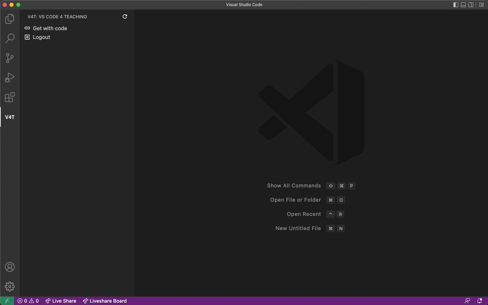 |

## Developer guide

**Sections**
- [License](#license)
- [Architecture](#architecture)
- [How to quickly start up a server](#how-to-quickly-start-up-a-server)

### License
VSCode4Teaching is an application released under *Apache License 2.0*, which is a permissive license that allows the modification, distribution and public and private use of the source code of all the components of the application as long as the original *copyright* is guaranteed.

Therefore, it is possible to use the tools provided by GitHub (such as *Issues* or *Pull Requests*) to contact the developer in charge or to propose functionality improvements or bug fixes that users of this *Open Source software* may detect during their modification or reuse processes.

The license can be checked and read in the file [LICENSE](LICENSE) of the repository (in the root directory).

### Architecture
VSCode4Teaching is composed of three components that work cooperatively with each other. The source code of each component is placed in directories located in the root location of this repository. They are:
- A **web server** ([**``vscode4teaching-server``**](vscode4teaching-server)) based on the Spring Boot *framework* that takes the role of *backend* in the application, performing the tasks of: managing the persistence and interpretation of information, storing the files that conform the exercises (both templates and proposed solutions) and exposing a REST API that allows communication with the other components.  
  More information about the web server can be found in its respective [README](vscode4teaching-server/README.md) (in the root directory of the component).
- A **extension** (*plugin*) for Visual Studio Code ([**``vscode4teaching-extension``**](vscode4teaching-extension)) based on Node.js that acts as a *frontend*, being the component that is installed in the IDE and that allows users to use an intuitive and friendly GUI to interact with the *backend* and thus be able to access all the functionality of the application. Although it is server-independent in terms of code, it is necessary to configure a connection to a VSCode4Teaching server to be able to use the functionality of this extension.  
  More information about the extension can be found in its respective [README](vscode4teaching-extension/README.md) (in the root directory of the component).
- A **web application** ([**``vscode4teaching-webapp``**](vscode4teaching-webapp)) based on the Angular *framework* that acts as a complementary web *frontend* to the extension (from which it is independent), allowing to expand its functionality beyond the IDE to incorporate features such as two-step registration for teachers or the creation of the custom help page for students. It is intended to be built and introduced in the server to be deployed inside it.

### How to quickly start up a server
To set up a VSCode4Teaching server, the fastest method is to use **Docker**, which is a lightweight container-based technology to speed up application deployment. For this purpose, some relevant files are inserted into the repository:
- A [``Dockerfile``](Dockerfile) file containing the necessary coding to compile the webapp and insert it as a server view, which is compiled and launched in a Java container. The image resulting from this compilation is published in [*Docker Hub*](https://hub.docker.com/r/vscode4teaching/vscode4teaching) each time a new version of the application is released.
- A file [``vscode4teaching-server/docker/docker-compose.yml``](vscode4teaching-server/docker/docker-compose.yml``) that allows using Docker Compose to quickly run two containers: one for the MySQL database used (``db``), for the image compiled from the ``Dockerfile`` above (``app``) and for the execution of a graphical database manager (``adminer``), which is optional and can be removed without affecting the operation of the server.
- A file [``vscode4teaching-server/docker/.env``](vscode4teaching-server/docker/.env) with user-customizable environment variables for the execution of the ``docker-compose.yml`` above.

Therefore, it is possible to run a VSCode4Teaching server directly using the ``docker-compose.yml`` file, by pointing a terminal to the directory containing it and running the command ``docker compose up -d`` (or ``docker-compose up -d`` in earlier versions of Docker).
In case you do not want to use the image published in the *Docker Hub*, it is possible to build the image manually by running a ``docker build -t vscode4teaching/vscode4teaching .`` command in the directory containing the ``Dockerfile``.

More information about the development of the application can be read in the ``README`` file of each of the components ([server](vscode4teaching-server/README.md) and [extension](vscode4teaching-extension/README.md)).