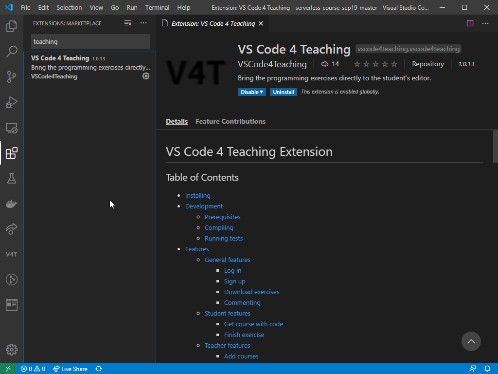
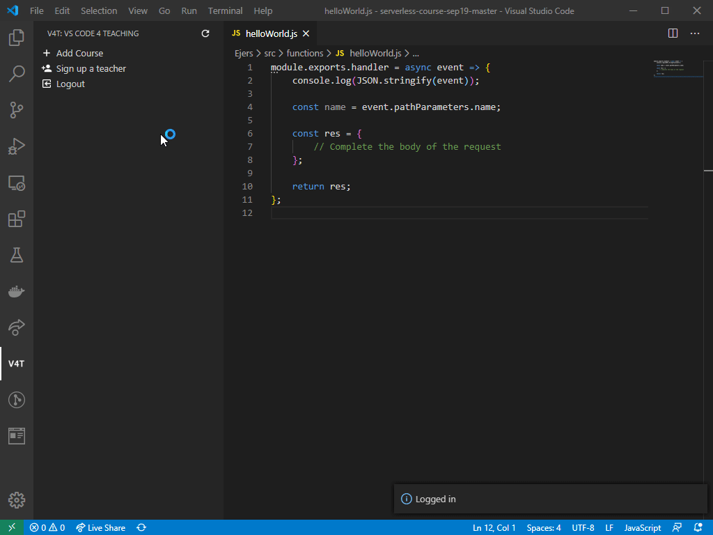
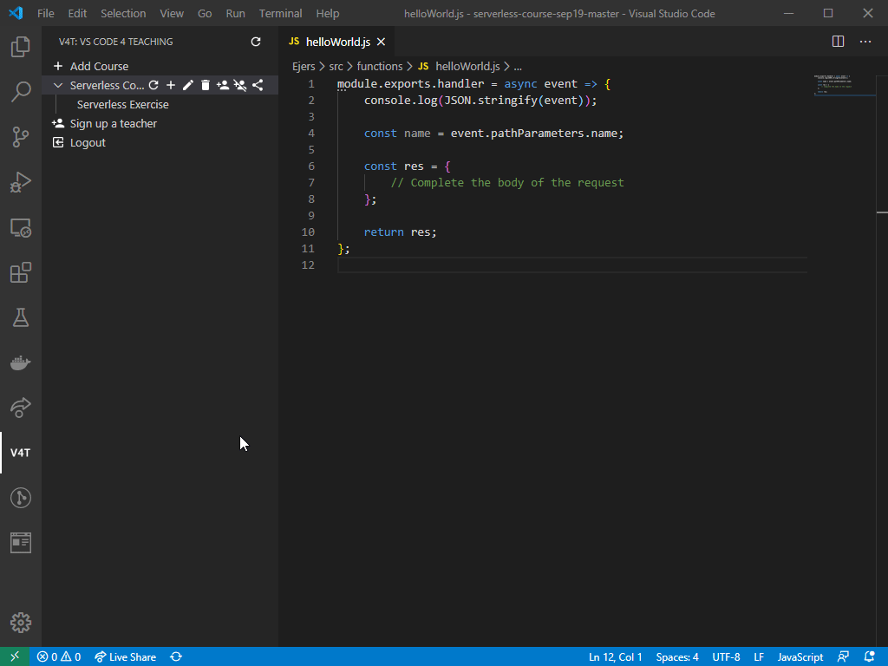
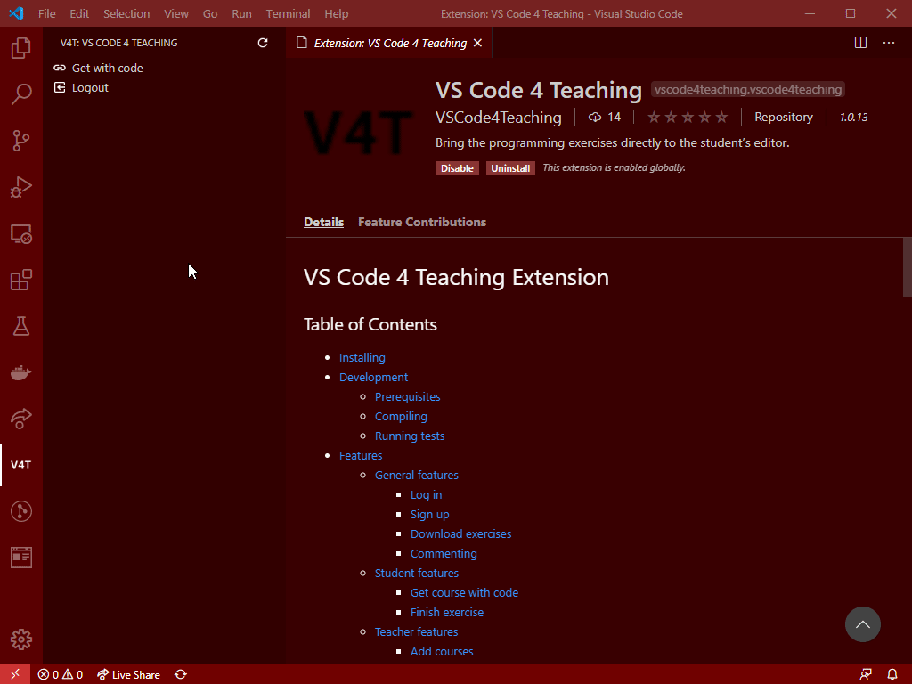
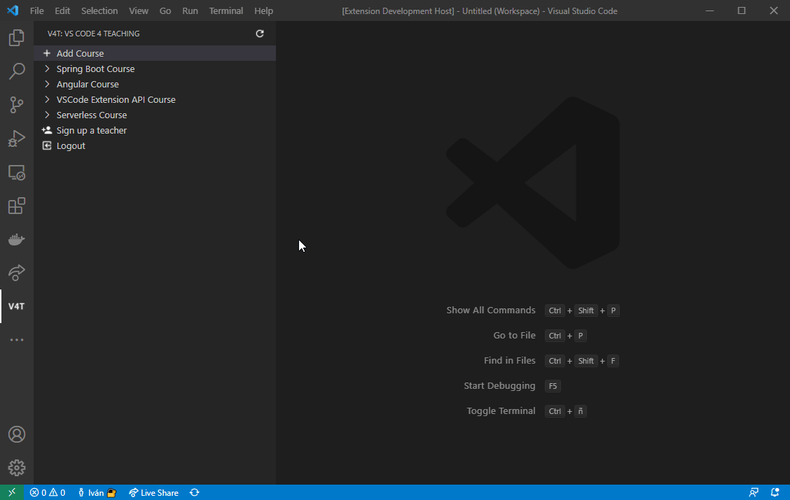
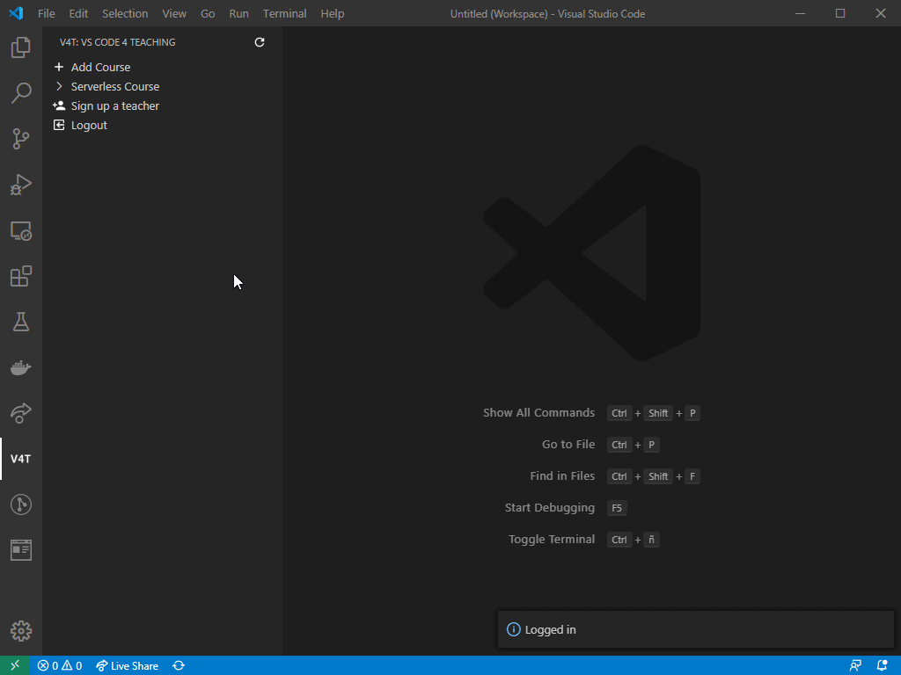
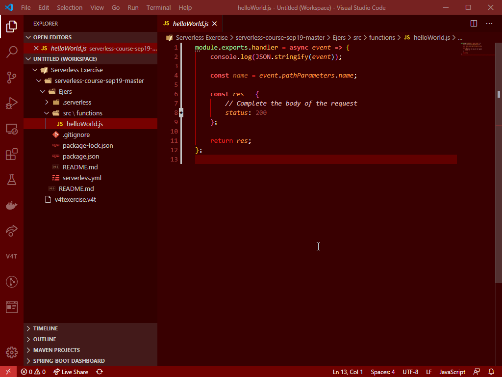

# 2019-VSCode4Teaching

  
VSCode extension for teaching.  
Bring the programming exercises of a course directly to the student’s editor, so that the teacher of that course can check the progress of the students and help them.  
Visit this [Medium blog](https://medium.com/@ivchicano) for updates on the development of this project.  

## Table of Contents

- [Common use case](README.md#common-use-case)
- [Introduction](README.md#introduction)
- [Running, installing and development](README.md#running-installing-and-development)
- [General Roadmap](README.md#general-roadmap)

## Introduction

The main features are:

- Teachers can create courses and exercises for the students.
- Students can download these exercises and upload their updated files.
- Teachers can download the students’ exercises to see their progress.  

There are 2 user roles: Teacher and Student.

- Teachers are capable of creating, editing, deleting, adding and removing users from courses. These courses have exercises, which have an associated template (files that serve as the base of the exercise) and each student’s files. Teachers can also download the students’ files to review them.
- Students can see these courses and exercises, download the templates and automatically upload their files to the server so that the teachers can see them.

## Common use case

1. Teacher installs the VSCode 4 Teaching extension from the [marketplace](https://marketplace.visualstudio.com/items?itemName=VSCode4Teaching.vscode4teaching):  
    
2. Ask another teacher to create you an account (you can contact micael.gallego@urjc.es for a teacher account)
3. Teacher creates a course and adds exercises in that course (remember to use .gitignore to ignore the files you don't want to share!):  
    
4. Teacher can create a code for sharing the course with the students. Students with this code can see the course and download the exercises. Teachers gets the code for sharing that course to his/her students:  
    
5. Students install the extension and sign up (if they don't have an account, only once):  
    
6. Students use the code from the teacher to access the course:  
      
7. Students start solving the exercise:  
    
8. Meanwhile the teacher checks the students' progress using the dashboard. From the dashboard the teacher can open the last edited file of a student and see the difference between the template and that file:  
    
9. When they finish the exercise, they mark it as finished:  
    
10. Teacher starts checking on the students' solutions and adding comments:  
    
11. Student checks the comments and responds to them:  
    

## Running, installing and development

The release comes with 2 artifacts: a server backend and the extension.
In the backend all the information is saved: courses, exercises, files… The server is implemented as a REST API.

The extension is a frontend to interact with the server API.

For information about the server click [HERE](/vscode4teaching-server/README.md).  
For information about the extension click [HERE](/vscode4teaching-extension/README.md).

## General Roadmap

- [x] Students can download course exercises and upload his files to the server.
- [X] Teachers can see a student's exercise.
- [X] Teachers can see the differences between student files and the original templates.
- [X] File uploads and downloads should account for .gitignore rules.  
- [X] Teachers can comment on a student's exercise.  
- [X] Make easier for students to access exercises (No need to log in or have a user).
- [X] Students can mark exercises as finished.  
- [X] Teachers have a dashboard to check students progress.
- [X] Remembers user session.
- [X] New exercises states.
- [X] Order dashboard columns.
- [X] Teachers can monitor exercises time.
- [X] Teacher's dashboard information updated in real time via websockets.
- [X] Quick access to user files via dashboard.
- [X] Live Share integration.
- [X] Help page created.

Note: This roadmap is subject to changes as requirements change.  
Check [Issues](https://github.com/codeurjc-students/2019-VSCode4Teaching/issues) and [Project](https://github.com/codeurjc-students/2019-VSCode4Teaching/projects) for more specific information about development of these milestones.
