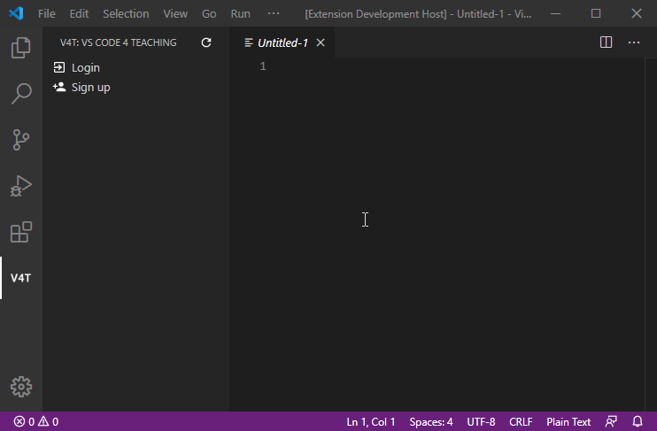
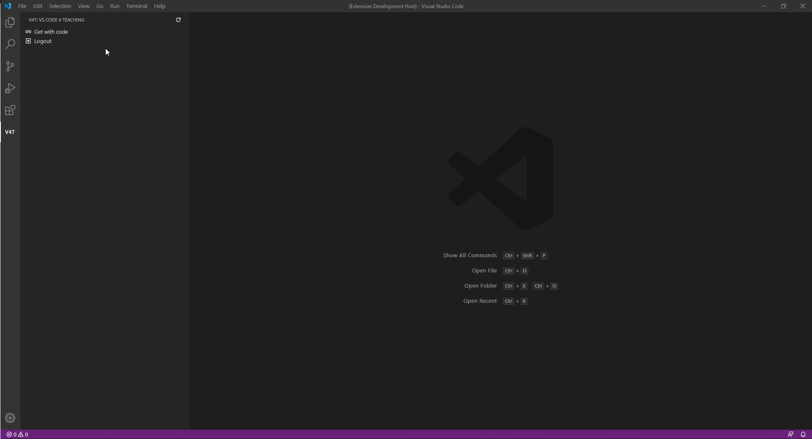
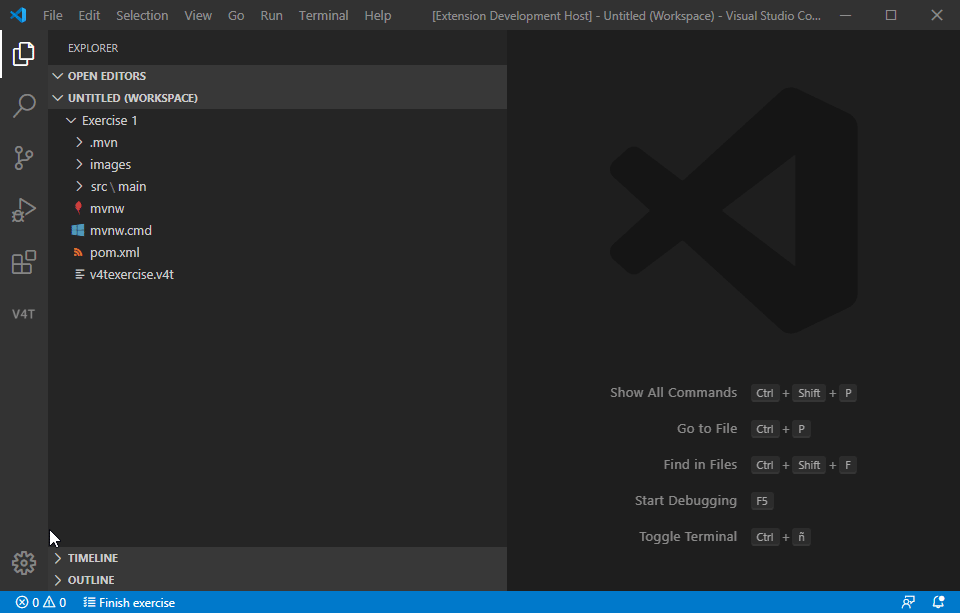
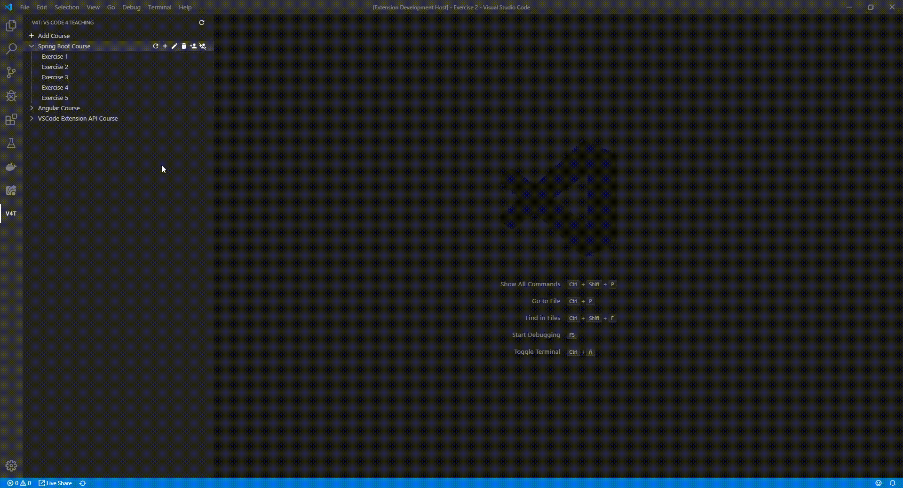
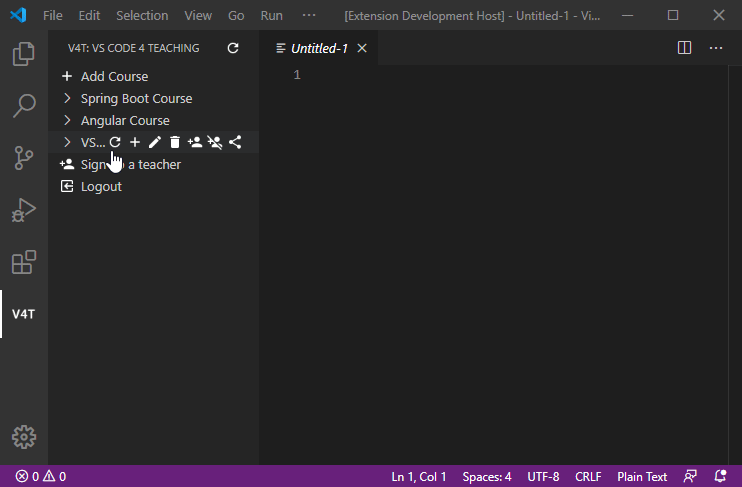

# VS Code 4 Teaching Extension

## Table of Contents

- [Installing](README.md#installing)
- [Development](README.md#development)
  - [Prerequisites](README.md#prerequisites)
  - [Compiling](README.md#compiling)
  - [Running tests](README.md#running-tests)
- [Features](README.md#features)
  - [General features](README.md#general-features)
    - [Log in](README.md#log-in)
    - [Sign up](README.md#sign-up)
    - [Download exercises](README.md#download-exercises)
    - [Commenting](README.md#commenting)
  - [Student features](README.md#student-features)
    - [Get course with code](README.md#get-course-with-code)
    - [Finish exercise](README.md#finish-exercise)
  - [Teacher features](README.md#teacher-features)
    - [Add courses](README.md#add-course)
    - [Edit course](README.md#edit-course)
    - [Delete course](README.md#delete-course)
    - [Add exercise](README.md#add-exercise)
    - [Edit exercise](README.md#edit-exercise)
    - [Delete exercise](README.md#delete-exercise)
    - [Add users to course](README.md#add-users-to-course)
    - [Remove users from course](README.md#remove-users-from-course)
    - [Difference between template and student file](README.md#difference-between-template-and-student-file)
    - [Share course with code](README.md#share-course-with-code)
    - [Sign up teacher](README.md#sign-up-teacher)
    - [Dashboard](README.md#dashboard)

## Installing

The best way to install the extension is through the Marketplace in Visual Studio Code.
Go to the Extensions on the left (Ctrl + Shift + X) and search for "VS Code 4 Teaching". It should appear the first on the list, from there you can just click Install to install it.

## Development

### Prerequisites

- Visual Studio Code: <https://code.visualstudio.com/>
- Node.js: <https://nodejs.org>
- Git: <https://git-scm.com/>

### Compiling

Open the vscode4teaching-extension folder with VS Code and press F5. This will compile and run the extension in a new Extension Development Host window.

### Running tests

Use the following command to run all tests:  
`npm test`  

## Features

VS Code 4 Teaching extension features a new view accessible from the V4T icon in the activity bar.

### General features

#### Log in

You will need to log in to the server first to do anything.  

### Sign up

You can sign up as a student.  

#### Download exercises

You can get the exercise template or your own files by clicking on an exercise.  
For students: editing files will trigger an automatic upload of new changes.  
Files in .gitignore will be ignored on automatic uploads.  

#### Commenting

Students and teachers can comment on files and respond to comments.  

### Student features

#### Get course with code

Students can get access to a course if they have the sharing code given by a teacher.  

#### Finish exercise

Students can mark their exercises as finished to help the teacher check on their progress.

### Teacher features

#### Get student files

If you are a teacher, clicking on an exercise will instead download de files of all students so that you can see their progress.  

#### Add Course

A teacher can create new courses.  

#### Edit course

The creator of a course can edit his/her courses.  

#### Delete course

The creator of a course can delete his/her courses.  

#### Add exercise

The teachers of a course can add exercises to that course. It will ask for a name and files to upload as a template.  
Files in .gitignore will be ignored.  

#### Edit exercise

The teacher of a course can edit the exercises.  
Files in .gitignore will be ignored.  

#### Delete exercise

The teacher of a course can delete the exercises.  

#### Add users to course

The teachers of a course can add students and teacher to the course.  

#### Remove users from course

The teachers of a course can remove students and teacher from a course.  

#### Difference between template and student file

Teachers can get the differences between a template file and its corresponding file in a students exercise.  
Beware that the files must be called the same for it to work.  

#### Share course with code

Teachers can share their courses with a code that students can use to retrieve said course.  

#### Sign up teacher

Teachers can sign up another teacher in the application.  

#### Dashboard

Teachers have a dashboard per exercise to check on their students' progress.

