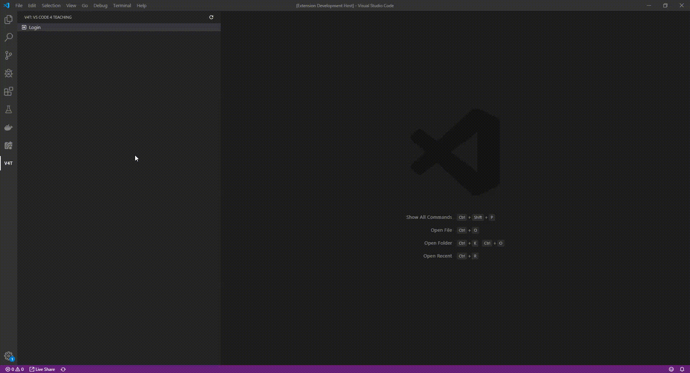
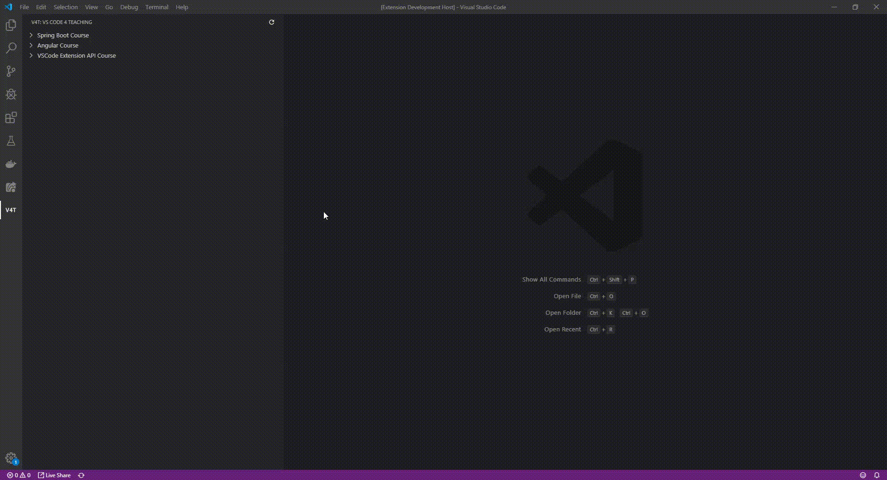
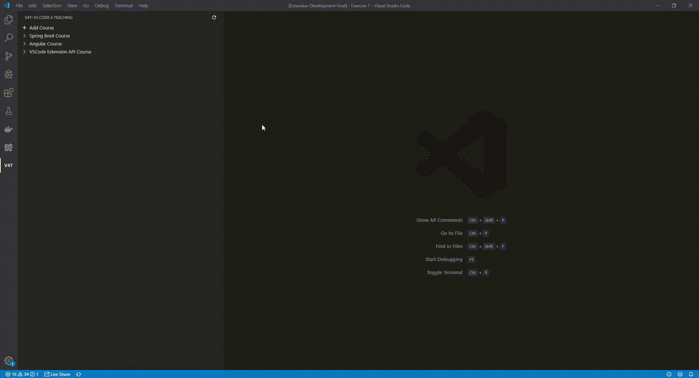
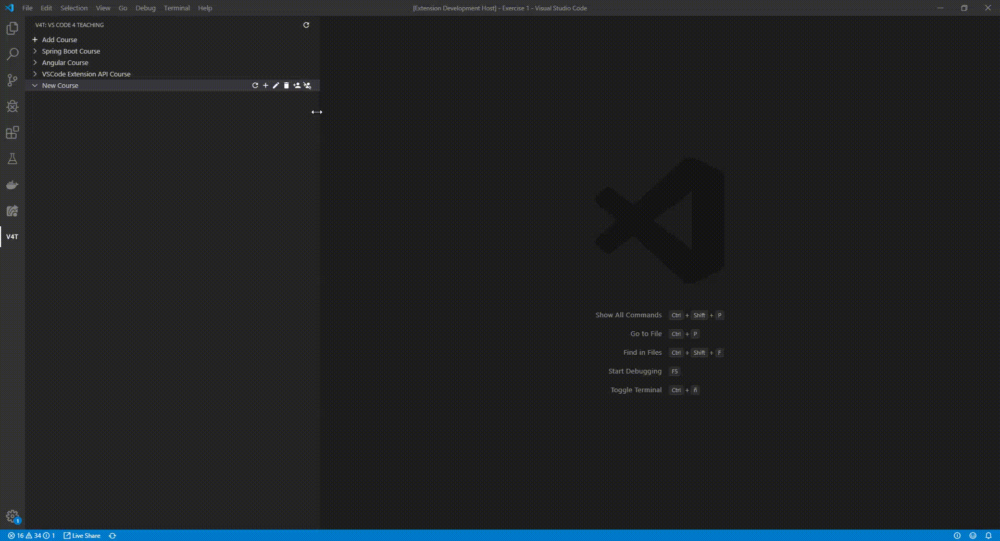
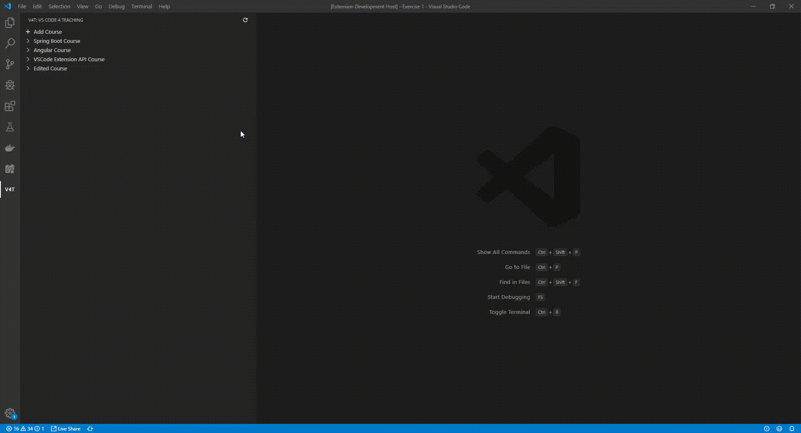
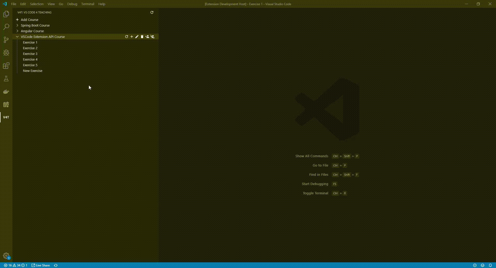
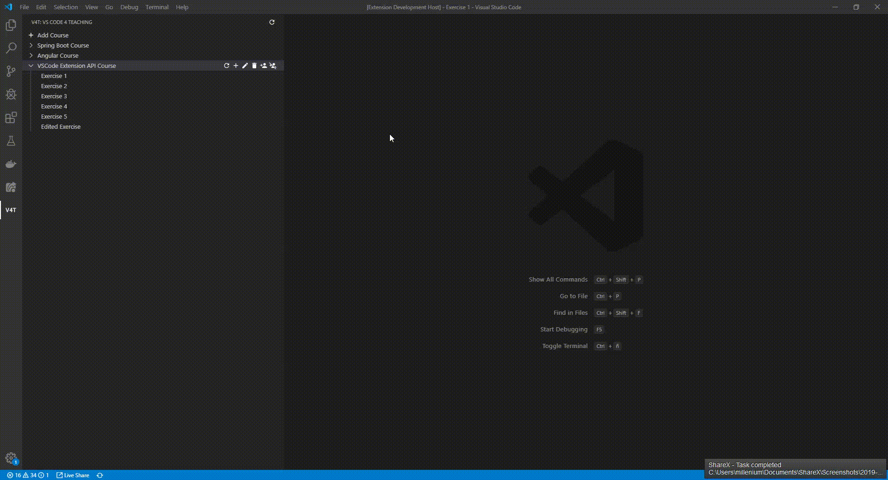
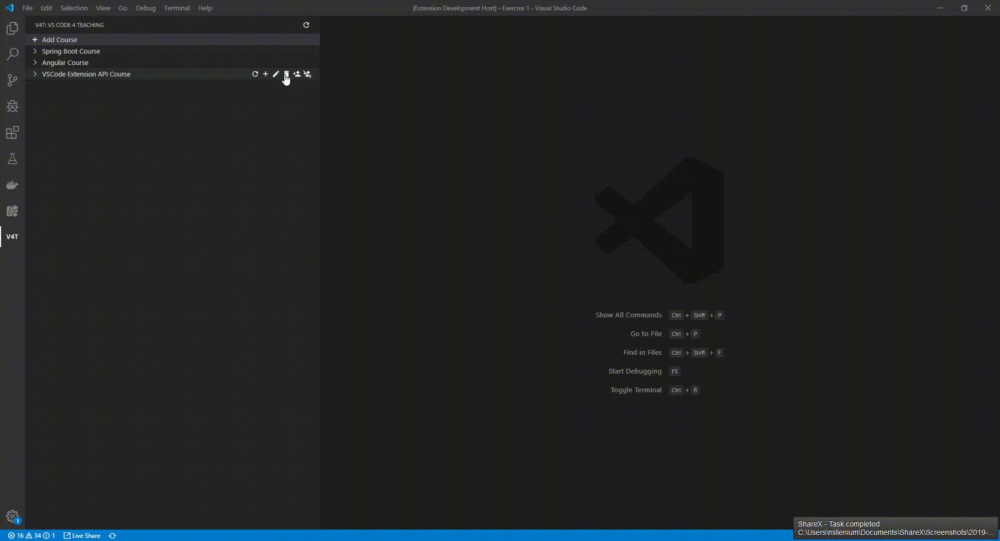
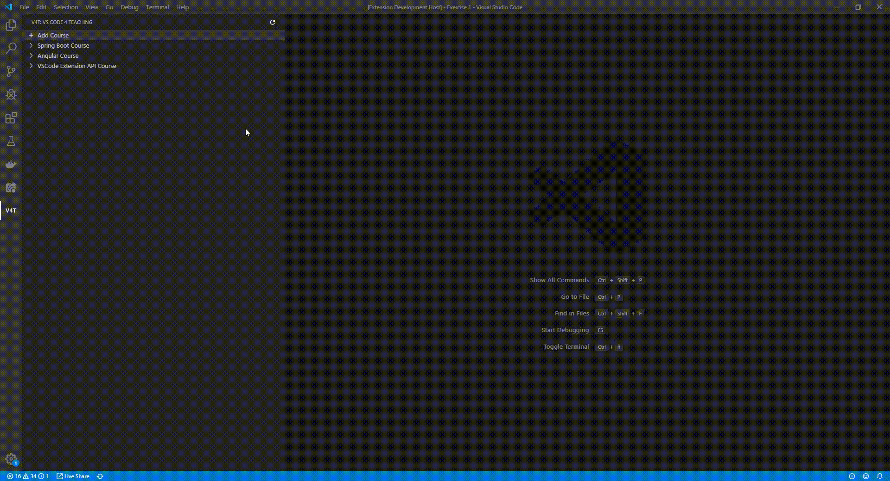

# VS Code 4 Teaching Extension

## Table of Contents

- [Installing](README.md#installing)
- [Development](README.md#development)
  - [Prerequisites](README.md#prerequisites)
  - [Compiling](README.md#compiling)
  - [Running tests](README.md#running-tests)
- [Features](README.md#features)
  - [Login](README.md#login)
  - [Download exercises](README.md#download-exercises)
  - [Teacher features](README.md#teacher-features)
    - [Add courses](README.md#add-course)
    - [Edit course](README.md#edit-course)
    - [Delete course](README.md#delete-course)
    - [Add exercise](README.md#add-exercise)
    - [Edit exercise](README.md#edit-exercise)
    - [Delete exercise](README.md#delete-exercise)
    - [Add users to course](README.md#add-users-to-course)
    - [Remove users from course](README.md#remove-users-from-course)

## Installing

The extension will be uploaded to the marketplace when te first roadmap milestone is completed. Until then to run the extension check the sections below.

## Development

### Prerequisites

- Visual Studio Code: <https://code.visualstudio.com/>
- Node.js: <https://nodejs.org>
- Git: <https://git-scm.com/>

### Compiling

Open the vscode4teaching-extension folder with VS Code and press F5. This will compile and run the extension in a new Extension Development Host window.

### Running tests

Use the following command to run the tests:  
`npm run test`

## Features

VS Code 4 Teaching extension features a new view accessible from the V4T icon in the activity bar.

### Login

You will need to log in to the server first to do anything.

### Download exercises

You can get the exercise template or your own files by clicking on an exercise.

### Teacher features

#### Add Course

A teacher can create new courses.

#### Edit course

The creator of a course can edit his/her courses.

#### Delete course

The creator of a course can delete his/her courses.

#### Add exercise

The teachers of a course can add exercises to that course. It will ask for a name and files to upload as a template.

#### Edit exercise

The teacher of a course can edit the exercises.

#### Delete exercise

The teacher of a course can delete the exercises.

#### Add users to course

The teachers of a course can add students and teacher to the course.

#### Remove users from course

The teachers of a course can remove students and teacher from a course.

